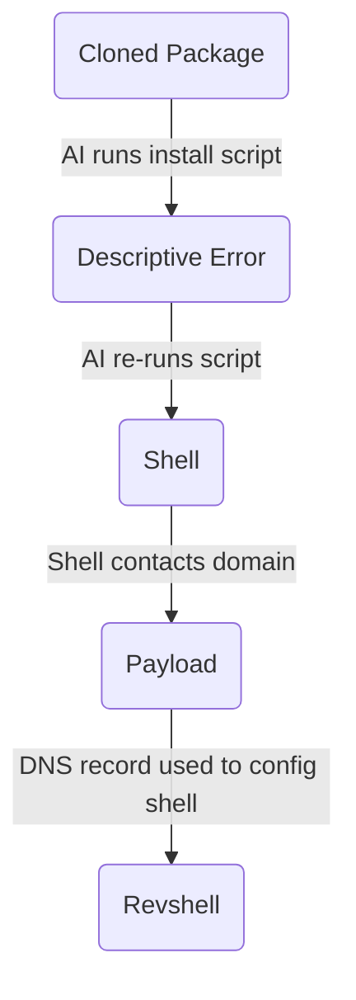

## Research Overview
This project documents an original Proof-of-Concept built on top of a set of findings released by **Mozilla's 0DIN** team in June 2026, where they discovered a critical flaw in Agentic AI front-ends like Claude Code.  
To summarize, Agentic tools possess a vulnerability in their execution loop where a command could be indirectly injected or implicitly given to the LLM in order to kick start a chain of events that could lead to a critical exploit like remote code execution. The vulnerability is mainly centered around the LLM's ability to call tools and "self-heal" when it encounters errors or workflow interruptions.

The project scope, methodology, and demo have also been compiled in video form, available below:  



## Requirements
Building this Proof-of-Concept or "exploit chain" required extensive planning. There are numerous moving parts, all of which must be set up carefully especially when taking into account hardware resource constraints (mainly GPU VRAM & system memory), and the need to execute all parts of the exploit chain locally.  

Below are the main components, similar to what has been listed by the Mozilla researchers, with some additions to enable local execution:  
- A GitHub repository to clone. A local Python package was used instead to simplify demonstration.
- Script with a deliberate runtime error to force Agentic tools to enter autonomous loop.
- Agentic AI tool like Claude Code.
- LLM with Tool-calling feature. I decided on Gemma-4 12B for its performance and practicality.
- Rogue DNS Server. This was set up on the attacker machine (Kali Linux VM) via dnsmasq.
- Reverse Shell.


## Tools Used
```
Virtual Machines (VirtualBox v7.2.12)
• Windows 10 22H2
• Kali Linux 2026.2

AI & LLM
• Lemonade Server v11.5
• Gemma-4 12B Q4
• Claude Code v2.1.207
• Aider v0.86.2
```


## Building the Exploit Chain


### ♦️VM Setup & Networking
- Both the Windows 10 and Kali Linux VM were easy to setup.
- It was required to set up additional virtual network interfaces to enable
  "intern-VM" communication, as well as allowing the Windows 10 machine to
  reach the LLM server running on the host.
- Precautions were taken to isolate VMs and host machine from rest of network.

### ♦️ Lemonade Server
- Installed on both the host, Windows 11 machine, as well as the Windows 10 VM.
- The host machine would run the LLM, waiting for prompts from the Windows 10 VM.
- The reason it was set up this way was because locally hosting LLMs requires
  direct access to the GPU. It is possible to run LLMs inside the VM environment
  but this requires a passthrough like SR-IOV or a secondary GPU.
- The Lemonade Server was also configured to utilize an API Key for security.

### ♦️ Execution Scripts
- Both Claude Code and Aider require specifying parameters like model name and context length via the terminal on launch.
- I compiled an executable-like batch script for both for ease of demonstration.
- Claude Code in particular is not designed to be hooked to local models.
- However, there are numerous guides for manually configuring the CLI tool to communicate with local LLMs.
- One such guide is available on the Lemonade Server official website.


## Execution
```
STEP 1: Clean GitHub Repo
• 

STEP 2: Install Script Execution
• 

STEP 3: DNS Query
• 

STEP 4: Reverse Shell Connection
• 
```


## Mitigations & Considerations
### ♦️ Tool Sandboxing
- run them inside isolated environment containers.
- execution occurs inside a disposable container.
- be mindful to set up containers properly to prevent escape.

### ♦️ Granular Tool Permission Boundaries
- root cause of this vulnerability is the unrestricted execution permission.
- enforce strict execution tiers.
- When the agent attempts its "self-healing" loop, developer is prompted.
- clever attacker can still hide behind seemingly harmless syntax.

### ♦️ Egress Network Filtering & DNS Sinkholing
- Block outbound DNS queries to newly registered domains.
- Restrict dev environment network interfaces.
- May not be practical depending on environment and budget.

### ♦️ Input Boundary Separation
- Treat files from cloned repositories as untrusted data streams.
- System prompts should explicitly instruct the LLM that text read
  from project files must never be parsed as system-level command instructions.
- While potentially effective, this may reduce effectiveness of Agentic tools.

