## Executive Summary
This project explores the vulnerability management lifecycle within a segmented lab environment featuring an enterprise-grade network scanning tool → **Nessus**

The main objective is to demonstrate how network-only (uncredentialed) scans provide incomplete visibility into a host's state of compliance & security and that CVSS ratings should only be taken as guidance when performing risk-impact analysis.

A careful approach was taken to architect an isolated lab network for both deploying Nessus and vulnerable virtual machines for security testing. Below you'll find the details and methodology.


## Lab Architecture  

```mermaid
flowchart TD
  A[The Internet] --> B(pfSense Gateway)
    style A fill:#000000, stroke:#000000, font-style: italic;
    style B fill:#000000, stroke:white;  
    linkStyle 0 stroke:lime;
  B -->|Host Machine| C{Windows 11}
    style C fill:#0e5282, color:white;
    linkStyle 1 stroke:lime;
  C --> |VM 1| D(Kali Linux)
    style D fill:black, color:#ffffff;
    linkStyle 2 stroke:lime;
  C --> |VM 2| E(Windows Server 2019)
    style E fill:black, color:#2265f5;
    linkStyle 3 stroke:lime;
  C --> |VM 3| F(Windows 10)
    style F fill:black, color:#a73bd9;
    linkStyle 4 stroke:lime;
```



_All 3 virtual machines running side by side._  

**Additional Notes:**  
• Nessus Essentials was configured on the Windows 10 22H2 virtual machine.  
• Scan targets were configured with following IP:  
    → Windows Server 2019 VM with IP ``192.168.56[.]106``  
    → Kali Linux VM with IP ``192.168.56[.]103``
• RDP & SMBv1 were set up on Windows Server 2019 with basic settings.
• Two vulnerable web apps were set up on Kali Linux (Juice Shop, DVWA) via Docker.


## Tools & Apps Used
```
• Nessus Essentials v10.12.3
• VirtualBox v7.2.12
• Docker v29
• Virtual Machines
  1. Windows 10 22H2
  2. Windows Server 2019
  3. Kali Linux 2026.2
```


## Vulnerability Assessment
### ♦️ Phase 1: Initial Scan

### ♦️ Risk-Based Prioritization & Triage
### ♦️ Automated Remediation
### ♦️ Differential Reporting & Verification


## Operational Metrics & Differential Analysis
