## Executive Summary
This project explores the vulnerability management lifecycle within a segmented lab environment featuring an enterprise-grade network scanning tool → **Nessus**

The main objective is to demonstrate how network-only (uncredentialed) scans provide incomplete visibility into a host's state of compliance & security and that CVSS ratings should only be taken as guidance when performing risk-impact analysis.

A careful approach was taken to architect an isolated lab network for both deploying Nessus and vulnerable virtual machines for security testing. Below you'll find the details and methodology.

## Lab Architecture

```mermaid
flowchart TD
  A[The Internet] --> B(pfSense Gateway)
  style A fill:#000000, stroke:#000000, font-style: italic;
  style B fill:#000000, stroke:white;  
    linkStyle 0 stroke:lime;
  B -->|Host Machine| C{Windows 11}
  C --> |VM 1| D[Windows 10]
  C --> |VM 2| E[Windows Server 2019]
  C --> |VM 3| F[Kali Linux 2026.2]
```

_All 3 virtual machines running side by side._  

**Additional Notes:**  
• Insert  
• Text  
• Here  

## Vulnerability Lifecycle Methodology
### ♦️ Security Assessment & Gap Analysis
### ♦️ Risk-Based Prioritization & Triage
### ♦️ Automated Remediation
### ♦️ Differential Reporting & Verification

## Operational Metrics & Differential Analysis
