## Executive Summary
This project explores the vulnerability management lifecycle within a segmented lab environment featuring an enterprise-grade network scanning tool → **Nessus**

The main objective is to demonstrate how network-only (uncredentialed) scans provide incomplete visibility into a host's state of compliance & security and that CVSS ratings should only be taken as guidance when performing risk-impact analysis.

A careful approach was taken to architect an isolated lab network for both deploying Nessus and vulnerable virtual machines for security testing. Below you'll find the details and methodology.


## Lab Architecture  

```mermaid
flowchart TD
  A[The Internet] --> B(pfSense Gateway)
    style A fill:#000000, stroke:#000000, font-style: italic;
    style B fill:#000000, stroke:white;  
    linkStyle 0 stroke:lime;
  B -->|Host Machine| C{Windows 11}
    style C fill:black, color:lime;
    linkStyle 1 stroke:lime;
  C --> |VM 1| D(Kali Linux)
    style D fill:black, color:#ffffff;
    linkStyle 2 stroke:lime;
  C --> |VM 2| E(Windows Server 2019)
    style E fill:black, color:#3d77f5;
    linkStyle 3 stroke:lime;
  C --> |VM 3| F(Windows 10)
    style F fill:black, color:#a73bd9;
    linkStyle 4 stroke:lime;
```



_All 3 virtual machines running side by side._  

**Additional Notes:**  
• Nessus Essentials was configured on the Windows 10 22H2 virtual machine.  
• Scan targets were configured with following IP:  
```192.168.56.103 [Kali Linux]```  
```192.168.56.106 [Windows Server 2019]```  

• RDP & SMBv1 were set up on Windows Server 2019 with basic settings.  
• Two vulnerable web apps were set up on Kali Linux (Juice Shop, DVWA) via Docker.


## Tools & Apps Used
```
• Nessus Essentials v10.12.3
• VirtualBox v7.2.12
• Docker v29
• Virtual Machines
  1. Windows 10 22H2
  2. Windows Server 2019
  3. Kali Linux 2026.2
```


## Vulnerability Assessment
### ♦️ Phase 1: Initial Scan  
Nessus Essentials was set up on the Windows 10 VM via the installer & guide provided on the official Tenable website. The service was then set to run manually instead of automatically on boot via the services.msc panel to better control resource usage.

The Nessus service can be started via the terminal with the following command:
``net start "Tenable Nessus"``


The Windows Server VM was set up with a basic deployment of SMBv1 and Remote Desktop, whereas the Kali Linux VM had password-based SSH service enabled alongside two vulnerable web apps hosted via Docker containers.

A Basic Network Scan (uncredentialed) was run targeting the two virtual machines with "Scan Type" set to default and "Discovery" set to "Scan all ports".  


___

### ♦️ Phase 2: Triage  
  

The screenshot above was taken after the first uncredentialed network scan. We can observe that, under the Vulnerabilities column, there are a total of ``60 events (7 Medium Severity)`` logged for the Windows Server 2019 VM, and ``39 events (1 Low Severity)`` logged for the Kali Linux VM.

Delving deeper into the scan results, we can see that neither OS-level vulnerabilities nor web applications hosted on them were detected or logged. This is because Nessus simply had no access to the machines with a basic, uncredentialed scan. This highlights the importance of setting up appropriate scans for the targets within the testing scope.

  
_Overall results post basic network scan (uncredentialed)._

In the case of the Kali Linux VM, we see that the highest-rated vulnerability listed is one of LOW severity, referring to "ICMP Timestamp Request Date Disclosure". Only INFO level logs pertaining to the SSH service and web applications hosted on that machine were recorded with no serious flags of immediate vulnerabilities.

  

We now run a scan called "Credentialed Patch Audit" which functions like a basic scan but with the use of credentials that allows Nessus to access the targets on a deeper level. The scan was set up as before, with default settings and "Discovery" set to all ports. Below are the results post credentialed scan:  

  

We can observe an immediate uptick in the number of vulnerabilities detected, with some even being HIGH severity. Alongside Credentialed Patch Audit, a Web Application Tests scan was run on the Kali Linux VM. These are the results:

  

With deeper, system-level access, Nessus was able to spot vulnerabilities more effectively, leading to a completely different scenario for analysis.  

For the next phase, we will focus on the vulnerabilities detected under the Windows Server 2019 VM for ease of demonstrating risk-impact analysis.  

___

### ♦️ Phase 3: Differential Analysis
- Pick vulnerabilities
- compare and prioritize
- example scenario

### ♦️ Phase 4: Automated Remediation
- Building scripts to handle fixes
- Windows fixes
- Linux fixes
- rerun credentialed scan
