## Executive Summary
This project explores the vulnerability management lifecycle within a segmented lab environment featuring an enterprise-grade network scanning tool → **Nessus**

The main objective is to demonstrate how network-only (uncredentialed) scans provide incomplete visibility into a host's state of compliance and security. It also seeks to underline the importance of interpreting CVSS ratings as **guidelines**, not rules, when performing risk-impact analysis to prioritize remediation efforts.

A careful approach was taken to architect an isolated lab network for both the deployment of Nessus as well as the vulnerable virtual machine targets for security testing. Below you'll find the details and methodology.

___

## Lab Architecture  

```mermaid
flowchart TD
  A[The Internet] --> B(pfSense Gateway)
    style A fill:#000000, stroke:#000000, font-style: italic;
    style B fill:#000000, stroke:white;  
    linkStyle 0 stroke:lime;
  B -->|Host Machine| C{Windows 11}
    style C fill:black, color:lime;
    linkStyle 1 stroke:lime;
  C --> |VM 1| D(Kali Linux)
    style D fill:black, color:#ffffff;
    linkStyle 2 stroke:lime;
  C --> |VM 2| E(Windows Server 2019)
    style E fill:black, color:#3d77f5;
    linkStyle 3 stroke:lime;
  C --> |VM 3| F(Windows 10)
    style F fill:black, color:#a73bd9;
    linkStyle 4 stroke:lime;
```



_All 3 virtual machines running side by side._  

**Additional Notes:**  
• Nessus Essentials was installed on the Windows 10 VM.  
• Scan targets were configured with following IP:  
```192.168.56.103 [Kali Linux]```  
```192.168.56.106 [Windows Server 2019]```  

• SMBv1 & RDP were initialized on the Windows Server 2019 machine with default settings.  
• Two vulnerable web apps were set up on Kali Linux (Juice Shop, DVWA) via Docker.

___

## Tools & Apps Used
```
• Nessus Essentials v10.12.3
• VirtualBox v7.2.12
• Docker v29
• Virtual Machines
  1. Windows 10 22H2
  2. Windows Server 2019
  3. Kali Linux 2026.2
```

___

## Vulnerability Assessment
### ♦️ Phase 1: Initial Scan  
Nessus Essentials was set up on the Windows 10 VM via the installer & guide provided on the official Tenable website. The service was then set to run manually instead of automatically on boot via the services.msc panel to better control resource usage.

The Nessus service can be started via the terminal with the following command:  
``net start "Tenable Nessus"``


The Windows Server VM was set up with a basic deployment of SMBv1 and Remote Desktop, whereas the Kali Linux VM had password-based SSH service enabled alongside two vulnerable web apps hosted via Docker containers.

A ``Basic Network Scan`` (uncredentialed) was run targeting the two virtual machines with ``Scan Type`` set to default and ``Discovery`` set to scan all ports.  


___

### ♦️ Phase 2: Triage  
  

The screenshot above was taken after the first uncredentialed network scan. We can observe that, under the Vulnerabilities column, there are a total of ``60 events (7 Medium Severity)`` logged for the Windows Server 2019 VM, and ``39 events (1 Low Severity)`` logged for the Kali Linux VM.

Delving deeper into the scan results, we can see that **neither** OS-level vulnerabilities nor web applications hosted on them were detected or logged. This is because Nessus simply had "surface-level" access to the machines with a basic uncredentialed scan. This highlights the importance of configuring appropriate scans for the targets within the testing scope.


_Basic Network Scan overall results._

In the case of the Kali Linux VM, we see that the highest-rated vulnerability listed is one of LOW severity, referring to ``ICMP Timestamp Request Date Disclosure``. Only INFO level logs pertaining to the SSH service and web applications hosted on that machine were recorded, with no serious flags of immediate vulnerabilities.

  

**Credentialed Scan**  
To access the target systems on a deeper level, we need to initiate a credentialed scan via ``Credentialed Patch Audit`` which enables Nessus to reach down to the system level through the use of supplied credentials like SSH keys, Administrator password, etc.  

The scan was set up as before, with default settings and ``Discovery`` set to all ports. Credentials for the Windows Server Administrator account and Kali Linux SSH password were entered into the fields on the ``Credentials`` tab.  
Below are the results post credentialed scan:  

  

We can observe an immediate uptick in the number of vulnerabilities detected, with some even being HIGH severity. Alongside ``Credentialed Patch Audit``, a ``Web Application Tests`` scan was run on the Kali Linux VM. These are the results:  

  

With deeper, system-level access, Nessus was able to spot vulnerabilities more effectively, leading to a completely different scenario for analysis.  

For the next phase, we will focus on the vulnerabilities detected under the Windows Server 2019 VM in order to easily demonstrate how risk-impact analysis plays a crucial role when prioritizing remediation work.

___

### ♦️ Phase 3: Differential Analysis
  

The screenshot above displays a list of vulnerabilities detected on the Windows Server 2019 VM. We will select a few of HIGH/MEDIUM severity to demonstrate an example scenario where risk-impact analysis is applied.

**WinVerifyTrust Signature Validation** ``CVSS 8.8``  
```
• CVE-2013-3900.
• Missing/misconfigured registry keys:
  → HKLM\Software\Microsoft\Cryptography\Wintrust\Config\EnableCertPaddingCheck
  → HKLM\Software\Wow6432node\Microsoft\Cryptography\Wintrust\Config\EnableCertPaddingCheck
• Attacker could send specially crafted requests to execute arbitrary code on host.  
```  

**Wireshark 2.6 Gryphon Infinite Loop** ``CVSS 7.5``
```
• CVE-2019-16319.
• The Gryphon dissector could enter an infinite loop.  
• Nessus has not tested for this issue.
• Instead relied on app's self-reported version number.  
```

**7-Zip Buffer Overflow & OOB Read** ``CVSS 8.4``  
```
• CVE-2023-52168 & CVE-2023-52169.
• NtfsHandler.cpp contains heap-based buffer overflow.  
• Allows attacker to overwrite 2 bytes at multiple offsets beyond allocated buffer size.  
• NtfsHandler.cpp also contains out-of-bounds read.  
• Allows attacker to read beyond intended buffer.  
• The bytes read beyond the intended buffer are presented as part of a filename in file system img.  
• Untrusted users can upload files and have them extracted by a server-side 7-zip process.  
```

**7-Zip Memory Corruption & ACE** ``CVSS 7.8``
```
• Flaw in a method in RarHandler.cpp.  
• Certain input isn't properly validated when performing 'solid' decompression of RAR archives.  
• With specially crafted file, attacker can cause memory corruption, leading to denial of service.  
• May even be able to execute arbitrary code (ACE).
```  

___

Based on the CVSS scores alone, one might rate the ``WinVerifyTrust Signature Validation`` vulnerability as more "critical" than say, the ``7-Zip Memory Corruption`` weakness. But security metrics like CVSS should only be taken as guidelines for the actual analysis work which should be rooted in an organization's specific needs for business continuity and effective operations.  

Businesses should consider the risk a vulnerability might pose to its operations and evaluate its potential impact. Another aspect that is essential for determining the priority for remediation efforts is the cost of the remediation itself to the business. This could in terms of time, monetary expenses, or opportunity costs to the business.

**Consider the following scenario:**  
- The target system scanned in this evaluation is part of a ``HR Portal & Applicant Tracking System.``
- This server is **mission-critical**, particularly during high-volume hiring seasons.
- Host stores Personally Identifiable Information (CVs, compensation history, etc.).
- The host is also exposed directly to inputs from untrusted external users (applicants uploading files).  

In this case, prioritizing remediation for the ``7-Zip Buffer Overflow`` vulnerability [CVE-2023-52168 & CVE-2023-52169] over the ``WinVerifyTrust`` weakness [CVE-2013-3900] would make sense for the following reasons:  

**CVE-2013-3900**  
```
• Low Risk as highly sophisticated exploit required.
• High Impact due to possibility of ACE.
• Cost of Remediation is high (time required for testing patches).
```
**CVE-2023-52168 & CVE-2023-52169**  
```
• High Risk as core function of server is tied to extracting zip/rar files.
• High Impact as single malicious CV can trigger buffer overflow, resulting in DoS.
• Cost of Remediation is low (minimal downtime for updating 7z app).
```

Similarly, with the Kali Linux machine, if its vulnerable web apps were public-facing and the machine itself was also mission-critical (required high availability), then it would be reasonable to prioritize the work of securing those web apps over other weaknesses that may have been detected on the system.  

___

### ♦️ Phase 4: Automated Remediation  
To ensure quick and effective remediation, we need to target the vulnerabilities on both systems in the priority order we have established earlier. In the case of the Windows Server 2019 VM, we can craft a batch script to quickly disable vulnerable protocols like SMBv1 and apply hardening steps for RDP.  
Below is a sample script that could be run with Administrator privileges:

**Batch Script**
```powershell
@echo off
net session >nul 2>&1
if %errorLevel% neq 0 (
	echo [ERROR] This script must be run as Administrator.
	echo Please re-run the script as Administrator.
	pause
	exit /b
)

title Security Update v1

echo ==================================================
echo STARTING SECURITY HARDENING (SMBv1 and RDP)
echo ==================================================

powershell -NoProfile -ExecutionPolicy Bypass -Command ^
"Write-Host '--- Disabling SMBv1 Protocol ---' -ForegroundColor Green; ^
Disable-WindowsOptionalFeature -Online -FeatureName SMB1Protocol -NoRestart; ^
Write-Host '--- Hardening RDP Registry Settings ---' -ForegroundColor Green; ^
$regPath = 'HKLM:\SYSTEM\CurrentControlSet\Control\Terminal Server\WinStations\RDP-Tcp'; ^
$regPath2 = 'HKLM:\SYSTEM\CurrentControlSet\Control\Terminal Server';^
$port = 3390; ^
Set-ItemProperty -Path $regPath -Name 'UserAuthentication' -Value 1; ^
Set-ItemProperty -Path $regPath -Name 'MinEncryptionLevel' -Value 3; ^
Set-ItemProperty -Path $regPath -Name 'SecurityLayer' -Value 2; ^
Set-ItemProperty -Path $regPath -Name 'PortNumber' -Value $port; ^
Set-ItemProperty -Path $regPath2 -Name 'WinstationDisabled' -Value 0; ^
Write-Host '--- Configuring Firewall Rule ---' -ForegroundColor Green; ^
New-NetFirewallRule -DisplayName 'RDP Non-Standard Port' -Direction Inbound -Action Allow -Protocol TCP -LocalPort $port; ^
Write-Host '--- Configuration Complete ---' -ForegroundColor Blue; ^
Write-Host 'Please reboot your machine to apply all changes.'"

pause
```
  

After launching the above script and subsequently updating both 7-Zip and Wireshark to the latest versions, another Credentialed Patch Audit scan was run to determine the differences.

